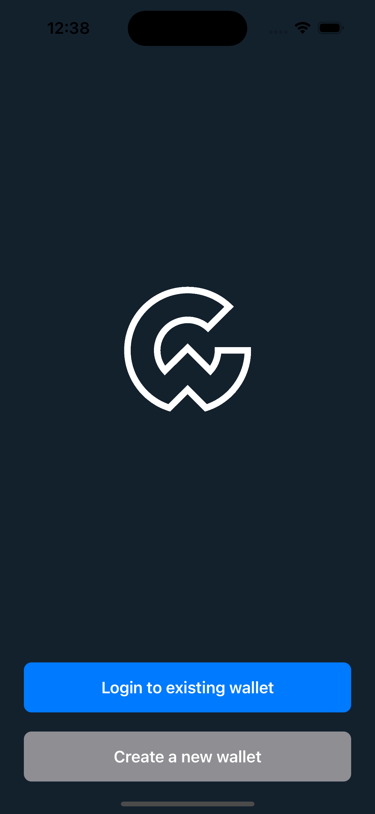
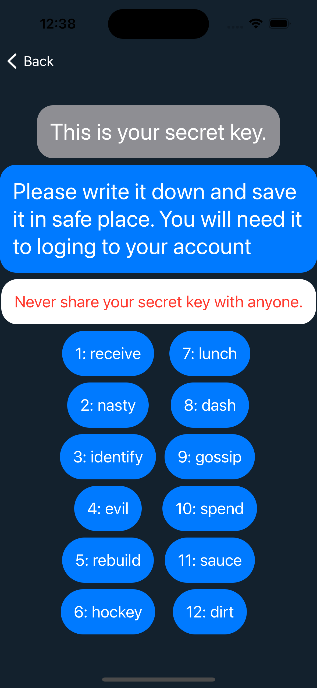
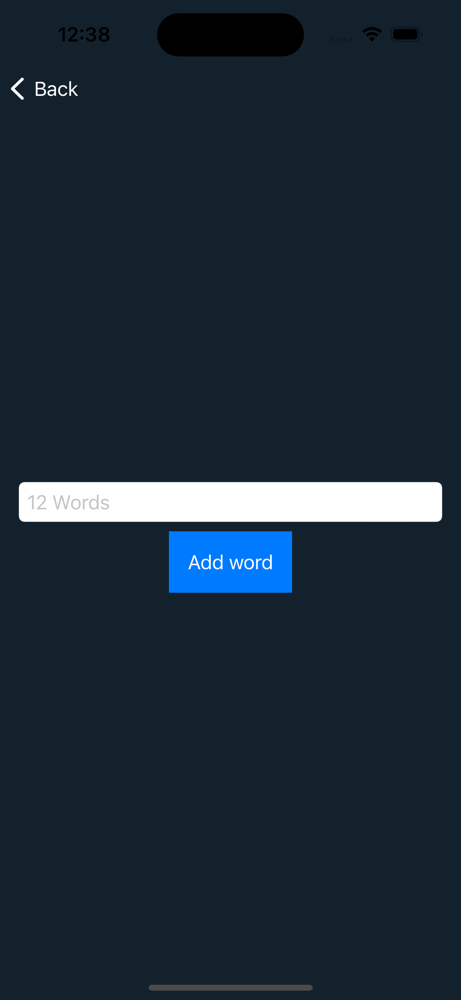
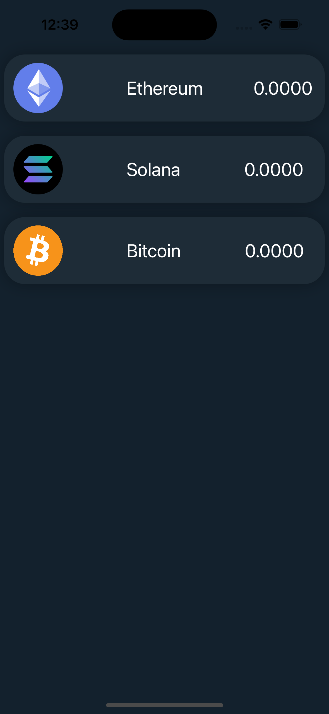
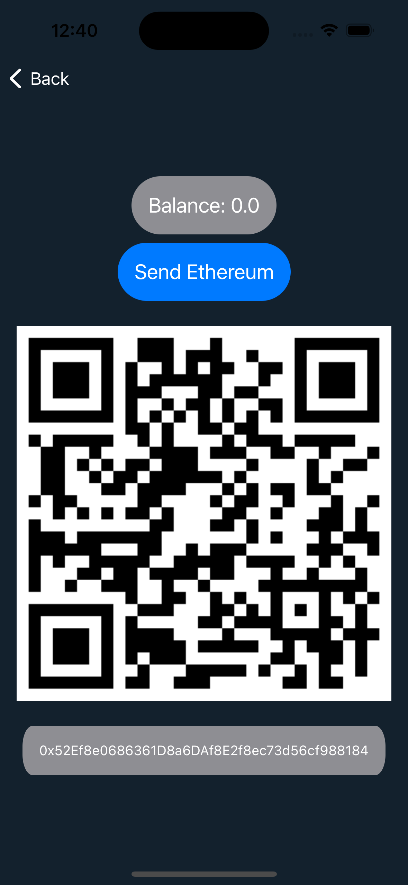
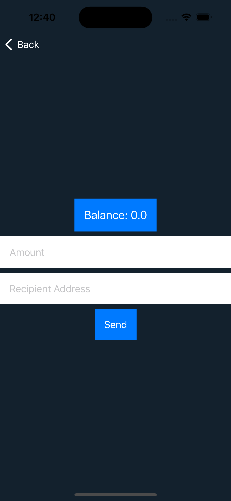

# CryptoWallet
Final project for COMPSCI 490 class at CSUN. Creating crypto wallet IOS applications. 

Highly Secure Cryptocurrency Wallet Solution

Experience the utmost security for your cryptocurrency with our cutting-edge wallet. Our platform extends its support to major cryptocurrencies including Bitcoin, Ethereum, and Solana.

Thorough testing has been conducted to ensure flawless transaction execution and seamless retrieval of wallet information, offering you a reliable and hassle-free experience.

Crafted with a focus on simplicity, this project boasts a minimalist yet functional design. Our commitment to keeping things straightforward guarantees a user-friendly interface for all. Moreover, your security remains our top priority. Rest assured that all your sensitive information is exclusively stored on your device, enhancing the overall safety of your crypto transactions.

  
  
  

  
  
  

